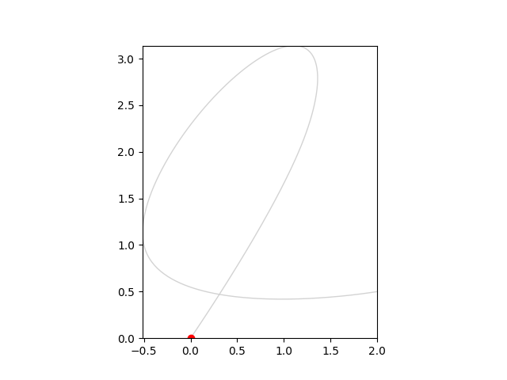

# 2D Minimum‑Snap Trajectory Generator
A C++ code for generating and a python code for visualizing 2D minimum‑snap trajectories through a sequence of waypoints. The solver computes 7th‑degree polynomial coefficients using the MOSEK QP solver, writes them to JSON, and a Python script animates the resulting path. Currently working on integrating the C++ code with ROS2 to visualize in Rviz instead.



---

## Prerequisites

### System

- C++17 toolchain (`g++` or `clang++`)
- [Eigen 3](https://eigen.tuxfamily.org/) (`libeigen3-dev`)
- [MOSEK C API](https://docs.mosek.com/latest/install/index.html) (set `$MSKHOME`)
- [nlohmann/json](https://github.com/nlohmann/json) header 

### Python

- NumPy
- Matplotlib
- Pillow

---

## Building & Running the C++ Solver

1. **Compile**:
   ```bash
   g++ -std=c++17 min_snap_2d_json.cpp -o min_snap_2d_json \
       -I/usr/include/eigen3 \
       -I"$MSKHOME/include" \
       -L"$MSKHOME/lib/x64" -lmosek64
   ```
2. **Run** to generate JSON:
   ```bash
   ./min_snap_2d_json
   ```
   Produces `min_snap_2d_coeffs.json`:
   ```json
   {
     "times": [0.0, 1.0, 2.5, 4.0],
     "coeffs_x": [ /* 24 values */ ],
     "coeffs_y": [ /* 24 values */ ]
   }
   ```
3. **Run visualizer**:
   ```bash
   python visualize_min_snap_2d.py
   ```
   Reads `min_snap_2d_coeffs.json` and writes `min_snap_2d.gif`.

---
